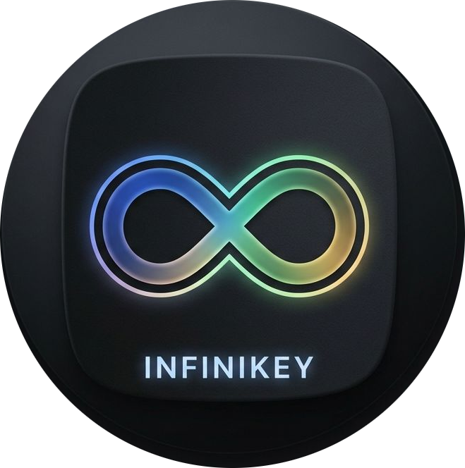

# Infinikey IME

An open-source, layout-driven, highly customizable soft keyboard for Android designed for power users, software developers, terminal environments (Termux, X11, VNC, RDP, SSH), and modern mobile typing.



---

## Key Highlights

- **Declarative Layout Engine**: JSON-driven keyboard layouts with row visibility toggling, Fn layer switching, staggered vs ortholinear key arrangements, and dynamic ratio-based geometry.
- **Powerful Macro System**: Bind complex macros, multi-touch gestures, swipe actions (`onSwipeUp`, `onSwipeDown`, `onSwipeLeft`, `onSwipeRight`), long-press popups, keycode auto-repeats, and app launchers directly to keys.
- **Decoupled Theme & Color Palette Engine**: 9 built-in presets (System Auto, System Light, System Dark, Slate Dark, Cyberpunk Neon, OLED True Black, Matrix Terminal, Retro Vintage, Muted Slate) plus custom HSL/RGB palette generation and theme JSON override loading.
- **Multiple Form Factors & Split Mode**: Docked, Left-Docked, Right-Docked, Split Thumb-Cluster, and Floating Window modes with drag handles and persistent offset memory.
- **Clipboard History Overlay**: Persistent overlay saving up to 30 copied items with index badges, character lengths, individual item deletion (`🗑`), clear-all, and direct echo-paste connection to both standard text fields and raw terminal shells.
- **Vector SVG Icon Engine**: Crisp native canvas rendering for vector icons (`mic`, `tts`, `paperclip`, `clipboard`, `copy`, `cut`, `paste`, `select_all`, `keyboard`) and user custom graphics scaling cleanly across all screen densities.
- **Trackpad Cursor Navigation**: Independent spacebar trackpad and arrow key trackpad modes for fluid desktop-class mouse and cursor control.
- **Authentic Mechanical Switch Audio Engine**: Integrated Mechvibes switch packs (Cherry MX Blue ABS/PBT, Brown ABS/PBT, Red ABS/PBT, Black ABS/PBT, NovelKeys Cream, EG Oreo, EG Crystal Purple, Topre Silent Purple, IBM Model M Buckling Spring) and 5 synthesized click audio modes with volume control.
- **Visual WYSIWYG Layout Editor**: Built-in Settings Activity with real-time drag-and-drop key reordering, row properties, undo/redo state stack, and layout customization.

---

## Architecture & Feature Breakdown

### 1. Declarative Layout & Macro System

Infinikey IME uses a flexible JSON layout descriptor specification (`docs/LAYOUT_DESCRIPTOR_SPEC.md`). Layouts are stored as standalone JSON files in `assets/layouts/` (e.g., `main.json`, `function.json`, `mobile.json`, `mobile_number.json`, `mobile_symbol.json`, `phone.json`).

#### Geometry & Dimensioning Rules
All key widths, heights, spacing gaps, font sizes, and corner radiuses use a strict dual-unit system:
- **Ratios (`Float`)**: Values like `1.0`, `1.5`, `0.02` represent ratios relative to the parent container (e.g. key width weight within a row, height ratio, or font size ratio).
- **Absolute DP (`Int`)**: Values like `4`, `8`, `16` represent fixed units in density-independent pixels.

#### Key Actions & Macro Triggers
Each key descriptor can define multiple touch event actions:
- **`onPress`**: Action executed on single tap.
- **`onLongPress`**: Action executed on touch and hold (with configurable timeout).
- **`onSwipeUp` / `onSwipeDown` / `onSwipeLeft` / `onSwipeRight`**: Directional swipe macros on individual keycaps.

#### Supported Macro Action Types
| Action `type` | Description |
| :--- | :--- |
| `"SEND_TEXT"` | Sends raw text strings or single characters directly to the input connection. |
| `"SEND_CODE"` | Sends specific Android `KeyEvent` keycodes (e.g. `67` for Backspace, `66` for Enter, `131` for F1). |
| `"MACRO"` | Replays or records custom multi-step keystroke macro sequences (e.g. `"M1"` through `"M10"`). Tap to replay/stop, long-press to record. |
| `"SWITCH_LAYOUT"` | Swaps active layout layer dynamically (e.g. `"function"`, `"mobile"`, `"main"`). |
| `"SET_SCREEN_MODE"` | Changes screen docking form factor (`"FULL_WIDTH_DOCKED"`, `"SPLIT"`, `"LEFT_DOCKED"`, `"RIGHT_DOCKED"`, `"FLOATING"`). |
| `"ADJUST_HEIGHT"` | Dynamically resizes keyboard display height percentage (15% to 60%). |
| `"SHOW_POPUP"` | Displays modern 3D tactile character/action selection popup menus. |
| `"SHOW_WIDGET"` | Spawns interactive sub-widget overlays (`"JOYSTICK"`, `"EMOJI_PICKER"`, `"CLIPBOARD_HISTORY"`, `"VOICE_INPUT"`). |
| `"AUTO_REPEAT"` | Continuously auto-repeats keycode execution while key is held down. |
| `"TOGGLE_ROW"` | Dynamically shows/hides individual row IDs (e.g. Fn row) or toggles layer visibility (`"all_hidden"`). |
| `"TOGGLE_MODIFIER"` | Toggles modifier state (`SHIFT`, `CTRL`, `ALT`, `SUPER`, `META`). |
| `"LOCK_MODIFIER"` | Locks modifier state (`SHIFT`, `CTRL`, `ALT`, `SUPER`, `META`). |
| `"SELECT_ALL"`, `"COPY"`, `"CUT"`, `"PASTE"` | Direct text editing and clipboard controls with fallback context support. |
| `"PASTE_ECHO"` | Echo-pastes primary clip to text input or raw terminal stream. |
| `"SWITCH_IME"` | Opens system Input Method Manager picker dialog. |
| `"LAUNCH_APP"` | Launches target Android application package directly from a key tap. |

#### Accessory Layout System, Accessory Text & Accessory Image
When the keyboard is docked in `SPLIT`, `LEFT_DOCKED`, `RIGHT_DOCKED`, or `SIDE_DOCKED` mode, an **Accessory Area** is created next to or between key clusters.
- **`accessoryLayout`**: Embeds a secondary keyboard layout inside this open space. Built-in options include `navigation` (arrow pad & navigation cluster), `mobile_number` (numeric keypad), `function` (F1–F12 function row), `macro` (Macro pad), `media` (multimedia control pad), `mobile_symbol` (symbol matrix), or `none`.
- **`accessoryImage`**: Embeds an asset image, custom graphic, file URI, or vector icon inside the accessory area. Proportional scaling ensures image height + text height fit cleanly inside container bounds.
- **`accessoryText`**: Renders custom multi-line text or headers (with custom `accessoryTextColor` and `accessoryTextSize`) centered directly beneath the image (if present) or centered in the accessory container when standalone.

#### Macro Keys System (`MACRO` Action)
- **Macro Recording & Replay**: Bind keycaps to `{"type": "MACRO", "id": "M1"}`. Long-pressing initiates keystroke recording; tapping stops recording and saves the step sequence (`pref_macro_<id>`). Single-tapping a recorded macro replays all steps.
- **Macro Pad Layout (`macro.json`)**: Includes a dedicated 2x5 grid layout featuring `M1` through `M10` macro keys with `macroKey` styling.

#### Text Placement in Spacing & Accessory Areas
- **Spacer Text (Spacing Between Keys)**: Keys configured as spacers (`"spacer": true` or `"style": "spacer"`) omit keycaps and touch hit-testing. Specifying `label` (or `secondaryLabel`) renders custom single- or multi-line text (`\n`) centered within key gaps with configurable `fgColor` and `fontSize`.
- **Accessory Area Text**: `metadata.accessoryText` renders centered watermark or informational text inside the side/center accessory area when split or docked.

---

### 2. Theme & Color Palette Engine

The color system is completely decoupled from layout descriptors (`docs/THEMING_SPEC.md`). Themes can be loaded from preset asset files (`themes.json`, `themes/cyberpunk.json`, etc.) or generated on the fly via the built-in custom palette picker.

#### Preset Color Themes
1. **System Dynamic (`system_auto`)**: Follows device OS Light Mode (`system_light`) and Dark Mode (`system_dark`) by default (customizable).
2. **System Light (`system_light`)**: Clean light mode theme with light slate background and crisp keycaps.
3. **System Dark (`system_dark`)**: Dark mode theme optimized for low-light environments.
4. **Slate Dark (`slate`)**: Default dark slate blue `#0F172A` theme with cyan and amber accents.
5. **Cyberpunk Neon (`cyberpunk`)**: High-contrast neon purple, yellow, magenta, and cyan palette.
6. **OLED True Black (`oled`)**: `#000000` pitch black background optimized for OLED display power saving.
7. **Matrix Terminal (`matrix`)**: Hacker green monochrome text on deep black.
8. **Retro Vintage (`retro`)**: Classic beige and taupe mechanical keyboard aesthetic.
9. **Muted Slate (`muted_slate`)**: Monochromatic low-saturation slate for distraction-free typing.
10. **Custom Palette (`custom`)**: User-configured theme defined via HSL/RGB palette generator or custom theme JSON files.

#### Category Style Mapping & Style Inheritance
Keys inherit visual attributes from style classes (`styles`), which can be overridden per key:
- **`alphaKey`**: Standard letter and punctuation keys.
- **`numberKey`**: Number row and numeric keypad keys.
- **`modifierKey`**: `Shift`, `Ctrl`, `Alt`, `Super`, `Fn` modifier keys.
- **`functionKey`**: `F1` through `F12` function keys.
- **`actionKey`**: Primary action keys (`Enter`, `Backspace`, `Space`, `Tab`, `Escape`).
- **`navigationKey`**: Navigation cluster keys (`PageUp`, `PageDown`, `Home`, `End`, `Arrows`).
- **`editingKey`**: Clipboard and text editing keys (`SelectAll`, `Copy`, `Cut`, `Paste`).

---

### 3. Form Factors & Floating Window Geometry

Infinikey IME supports 5 screen docking modes:
- **Full Width Docked**: Standard full-width anchored keyboard.
- **Left Docked**: Comfortably aligned to the left side for single-handed use.
- **Right Docked**: Comfortably aligned to the right side for single-handed use.
- **Split Mode**: Divides keys into left and right thumb clusters for large screens and tablets.
- **Floating Window Mode**: Renders a floating window with top handle bar for drag repositioning and persistent offset memory.

---

### 4. Trackpad & Cursor Navigation

Infinikey IME includes dual trackpad cursor emulation modes:
- **Spacebar Trackpad**: Long-pressing or sliding along the spacebar (`␣`) transforms the key into a precision cursor trackpad.
- **Arrow Key Trackpad / Joystick**: Sliding over arrow keys activates analog trackpad navigation with visual cursor feedback.

---

### 5. Mechanical Switch Audio & Haptic Feedback

- **Sound Engine**: Powered by `SoundPool` with recorded switch sound packs (Cherry MX Blue ABS/PBT, Brown ABS/PBT, Red ABS/PBT, Black ABS/PBT, NovelKeys Cream, EG Oreo, EG Crystal Purple, Topre Silent Purple, IBM Model M Buckling Spring) and 5 synthesized audio modes.
- **Build-Time Key Click Splitting Pipeline**: Automated Python pipeline (`scripts/split_key_clicks.py`) runs as part of the normal build process (`splitKeyClicks` Gradle task). It analyzes key press recordings, detects key-down (press) vs. key-up (release) transients using energy envelope and zero-crossing alignment, and outputs split sound sets to `app/src/main/assets/audio_split/`. Gradle automatically checks for missing or out-of-date split assets during `preBuild`.
- **Haptic Engine**: Supports System Haptics (`HapticFeedbackConstants`) and Android `Vibrator` with custom vibration styles (`SHARP_CLICK`, `CRISP_TICK`, `HEAVY_CLICK`, `DOUBLE_CLICK`, `CUSTOM_PULSE`), duration, and amplitude controls.

---

### 6. Dynamic Emoji Layout Generation

- **Build-Time Generation**: Python pipeline (`generate_emoji_layouts.py`) fetches Unicode emoji datasets, groups skin tones under base emojis in `alternates` arrays, and generates category asset layouts.
- **Runtime Recents Tracker**: Logs recently used emojis to `SharedPreferences` (up to 24) and dynamically generates the `"emoji_recents"` layout when tapping `😀`.

---

## Project Structure

- **`app/src/main/java/com/infinikey_ime/`**:
  - `ProgrammerInputMethodService.kt`: Core `InputMethodService` managing keyboard state, target terminal detection, clipboard listening, layout switching, and action dispatching.
  - **`view/`**:
    - `KeyboardView.kt`: High-performance custom canvas View rendering key rows, SVG vector icon paths, touch gestures, trackpad modes, and haptics.
    - `InteractiveLayoutEditorView.kt`: WYSIWYG canvas for real-time drag-and-drop key layout editing.
    - `KeyPopupOverlay.kt`: 3D tactile action popups with SVG icon caps and dismissal tracking.
    - `ClipboardHistoryOverlay.kt`: Floating scrollable clipboard history view with single-item deletion and quick paste.
    - `EmojiPickerOverlay.kt`: Grid emoji picker overlay window.
    - `VoiceInputOverlay.kt`: Floating voice recognition dialog.
    - `JoystickPopupWidget.kt`: Floating arrow trackpad widget.
    - `KeyPreviewOverlay.kt`: Magnified key pop-up preview bubble.
    - `TrackpadView.kt`: Precision trackpad navigation view.
  - **`model/`**:
    - `KeyDefinition.kt`: Strongly-typed `KeyAction`, `KeyDefinition`, `KeyStyle`, and `DimensionValue` data models.
    - `LayoutDefinition.kt`: Schema models for layout metadata, rows, keys, and themes.
    - `KeyboardMode.kt`: Screen mode and modifier state enums.
  - **`engine/`**:
    - `LayoutParser.kt`: JSON layout engine parsing layout descriptors and applying theme overrides.
    - `KeyRepeatEngine.kt`: Handles long-press timeouts and key auto-repeats.
    - `AlternatePriorityManager.kt`: Long-press alternate key prioritization engine.
  - **`settings/`**:
    - `SettingsActivity.kt`: Multi-tab preference and configuration activity.
  - **`util/`**:
    - `ThemeManager.kt`: Theme copying, versioning, upgrade protection, and management.
    - `AppPreferencesManager.kt`: Per-app layout assignment and persistence.
    - `IconRenderer.kt`: Native vector SVG rendering and custom icon loading.
    - `FontFallbackManager.kt`: Custom symbols font loading and fallback management.
    - `FileManagerLauncher.kt`: System document provider and file manager integration.
    - `InfinikeyDocumentsProvider.kt`: Storage Access Framework documents provider for live file editing.
    - `OverlayPermissionUtil.kt`: System overlay window permission utilities.
    - `SttArchiveUnpacker.kt`: On-device STT speech recognition model asset extractor.
  - **`stt/`**:
    - `SttEngine.kt`, `SherpaOnnxSttEngine.kt`, `AndroidSystemSttEngine.kt`, `WhisperSttEngine.kt`, `CloudApiSttEngine.kt`, `SttEngineFactory.kt`: Offline and online Speech-to-Text engines.

---

## Building the Project

Assemble debug or release APKs using Gradle:

```bash
./gradlew assembleDebug
./gradlew assembleRelease
```

Generated APK output locations:
- **Debug**: `app/build/outputs/apk/debug/infinikey-ime-v0.2.32-b183-debug.apk`
- **Release**: `app/build/outputs/apk/release/infinikey-ime-v0.2.32-b183-release.apk`

---

## License

This project is open-source under the [MIT License](LICENSE).

## Attributions & Credits

Mechanical keyboard switch audio samples are sourced from **[Mechvibes](https://mechvibes.com/)**. See [ATTRIBUTION.md](ATTRIBUTION.md) for full credits.

